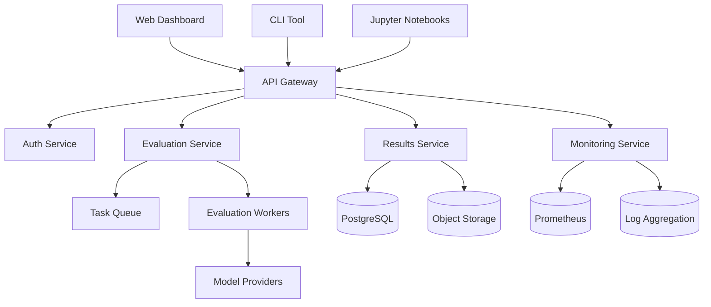
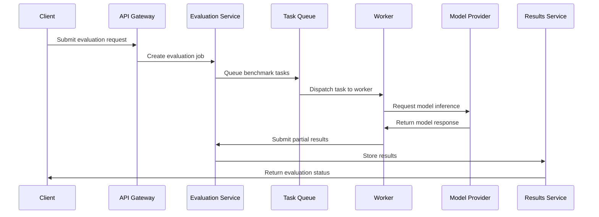
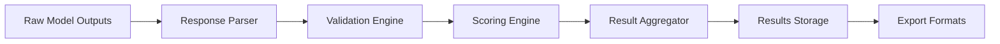
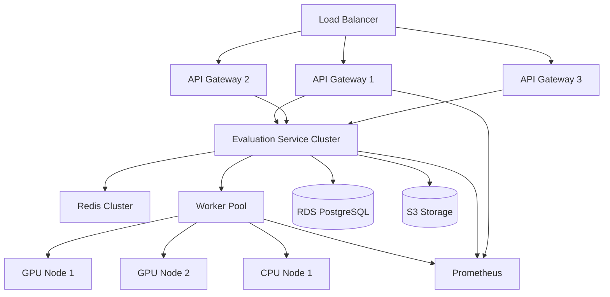

# Architecture Document
## AGI Evaluation Sandbox

### 1. System Overview

The AGI Evaluation Sandbox is a distributed, microservices-based platform for evaluating large language models across standardized benchmarks. The architecture prioritizes modularity, scalability, and extensibility while maintaining simplicity for single-user deployments.



### 2. Component Architecture

#### 2.1 Core Services

##### API Gateway (`api-gateway/`)
- **Purpose**: Central entry point for all client interactions
- **Technology**: FastAPI with async support
- **Responsibilities**:
  - Request routing and load balancing
  - Authentication and authorization
  - Rate limiting and throttling
  - API versioning and documentation
  - Request/response logging

##### Evaluation Service (`evaluation-service/`)
- **Purpose**: Orchestrates benchmark execution and model evaluation
- **Technology**: Python with async/await patterns
- **Responsibilities**:
  - Benchmark registration and discovery
  - Evaluation job scheduling and management
  - Model provider abstraction
  - Result aggregation and validation
  - Progress tracking and notifications

##### Results Service (`results-service/`)
- **Purpose**: Manages evaluation results and historical data
- **Technology**: FastAPI with SQLAlchemy ORM
- **Responsibilities**:
  - Result storage and retrieval
  - Data versioning and schema management
  - Query optimization and caching
  - Export and reporting functionality
  - Data retention policies

##### Worker Nodes (`workers/`)
- **Purpose**: Execute individual benchmark evaluations
- **Technology**: Celery with Redis broker
- **Responsibilities**:
  - Benchmark execution in isolated environments
  - Model inference and response processing
  - Error handling and retry logic
  - Resource monitoring and cleanup
  - Security sandboxing

#### 2.2 Data Layer

##### Primary Database (PostgreSQL)
```sql
-- Core schema structure
CREATE TABLE models (
    id UUID PRIMARY KEY,
    name VARCHAR(255) NOT NULL,
    provider VARCHAR(100) NOT NULL,
    version VARCHAR(100),
    metadata JSONB,
    created_at TIMESTAMP DEFAULT NOW()
);

CREATE TABLE benchmarks (
    id UUID PRIMARY KEY,
    name VARCHAR(255) UNIQUE NOT NULL,
    version VARCHAR(100),
    config JSONB,
    created_at TIMESTAMP DEFAULT NOW()
);

CREATE TABLE evaluations (
    id UUID PRIMARY KEY,
    model_id UUID REFERENCES models(id),
    benchmark_id UUID REFERENCES benchmarks(id),
    status VARCHAR(50) DEFAULT 'pending',
    config JSONB,
    started_at TIMESTAMP,
    completed_at TIMESTAMP,
    created_at TIMESTAMP DEFAULT NOW()
);

CREATE TABLE results (
    id UUID PRIMARY KEY,
    evaluation_id UUID REFERENCES evaluations(id),
    metrics JSONB NOT NULL,
    raw_data_path VARCHAR(500),
    created_at TIMESTAMP DEFAULT NOW()
);
```

##### Object Storage (S3-Compatible)
- **Raw evaluation data**: JSON files with complete model responses
- **Artifacts**: Generated reports, visualizations, exported data
- **Benchmark data**: Question sets, reference answers, evaluation scripts
- **Model artifacts**: Cached inference results, embeddings

#### 2.3 Client Interfaces

##### Web Dashboard (`dashboard/`)
- **Technology**: React 18 with TypeScript
- **Features**:
  - Real-time evaluation monitoring
  - Interactive result visualization
  - Model comparison tools
  - Benchmark management interface
  - Team collaboration features

##### Command Line Interface (`cli/`)
- **Technology**: Python Click framework
- **Features**:
  - Evaluation job submission
  - Result querying and export
  - Configuration management
  - CI/CD integration helpers

##### Jupyter Integration (`notebooks/`)
- **Technology**: IPython widgets and kernels
- **Features**:
  - Interactive evaluation workflows
  - Custom analysis notebooks
  - Visualization templates
  - Research collaboration tools

### 3. Data Flow Architecture

#### 3.1 Evaluation Workflow


#### 3.2 Data Processing Pipeline


### 4. Deployment Architecture

#### 4.1 Development Environment
- **Docker Compose**: Single-machine deployment with all services
- **Local databases**: PostgreSQL and Redis containers
- **File storage**: Local filesystem with S3-compatible interface
- **Monitoring**: Lightweight Prometheus and Grafana setup

#### 4.2 Production Environment


#### 4.3 Cloud-Native Deployment
- **Kubernetes**: Container orchestration with auto-scaling
- **Helm charts**: Standardized deployment configurations
- **Service mesh**: Istio for traffic management and security
- **Monitoring**: Prometheus, Grafana, and Jaeger for observability

### 5. Security Architecture

#### 5.1 Authentication & Authorization
- **JWT tokens**: Stateless authentication with refresh tokens
- **OAuth 2.0**: Integration with GitHub, Google, and enterprise SSO
- **RBAC**: Role-based access control with granular permissions
- **API keys**: Service-to-service authentication

#### 5.2 Data Security
- **Encryption at rest**: Database and object storage encryption
- **Encryption in transit**: TLS 1.3 for all communications
- **Secrets management**: Kubernetes secrets or HashiCorp Vault
- **Data isolation**: Multi-tenant data separation

#### 5.3 Runtime Security
- **Container scanning**: Vulnerability assessment in CI/CD
- **Network policies**: Kubernetes network segmentation
- **Sandboxing**: Isolated execution environments for workers
- **Audit logging**: Comprehensive security event logging

### 6. Scalability Considerations

#### 6.1 Horizontal Scaling
- **Stateless services**: All services designed for horizontal scaling
- **Database sharding**: Partition large datasets by model or benchmark
- **CDN integration**: Static asset delivery optimization
- **Edge deployment**: Regional worker pools for global access

#### 6.2 Performance Optimization
- **Caching layers**: Redis for frequently accessed data
- **Connection pooling**: Database connection optimization
- **Async processing**: Non-blocking I/O throughout the stack
- **Resource scheduling**: Intelligent worker allocation

#### 6.3 Auto-scaling Policies
```yaml
# Kubernetes HPA configuration
apiVersion: autoscaling/v2
kind: HorizontalPodAutoscaler
metadata:
  name: evaluation-service-hpa
spec:
  scaleTargetRef:
    apiVersion: apps/v1
    kind: Deployment
    name: evaluation-service
  minReplicas: 2
  maxReplicas: 20
  metrics:
  - type: Resource
    resource:
      name: cpu
      target:
        type: Utilization
        averageUtilization: 70
  - type: Resource
    resource:
      name: memory
      target:
        type: Utilization
        averageUtilization: 80
```

### 7. Integration Patterns

#### 7.1 Model Provider Integration
```python
class ModelProvider(ABC):
    @abstractmethod
    async def generate(self, prompt: str, **kwargs) -> str:
        pass
    
    @abstractmethod
    async def batch_generate(self, prompts: List[str], **kwargs) -> List[str]:
        pass
    
    @abstractmethod
    def get_limits(self) -> RateLimits:
        pass

class OpenAIProvider(ModelProvider):
    def __init__(self, api_key: str, model: str):
        self.client = openai.AsyncOpenAI(api_key=api_key)
        self.model = model
    
    async def generate(self, prompt: str, **kwargs) -> str:
        response = await self.client.chat.completions.create(
            model=self.model,
            messages=[{"role": "user", "content": prompt}],
            **kwargs
        )
        return response.choices[0].message.content
```

#### 7.2 Benchmark Framework Integration
```python
class BenchmarkAdapter(ABC):
    @abstractmethod
    def load_questions(self) -> List[Question]:
        pass
    
    @abstractmethod
    def evaluate_response(self, question: Question, response: str) -> Score:
        pass

class DeepEvalAdapter(BenchmarkAdapter):
    def __init__(self, benchmark_name: str):
        self.benchmark = deepeval.load_benchmark(benchmark_name)
    
    def load_questions(self) -> List[Question]:
        return [Question.from_deepeval(q) for q in self.benchmark.questions]
```

#### 7.3 CI/CD Integration
```yaml
# GitHub Actions workflow template
name: Model Evaluation
on:
  push:
    branches: [main]
  pull_request:
    branches: [main]

jobs:
  evaluate:
    runs-on: ubuntu-latest
    steps:
      - uses: actions/checkout@v3
      - name: Run Evaluation
        uses: agi-eval-sandbox/github-action@v1
        with:
          model: ${{ secrets.MODEL_CONFIG }}
          benchmarks: "mmlu,humaneval,truthfulqa"
          webhook_url: ${{ secrets.WEBHOOK_URL }}
```

### 8. Monitoring & Observability

#### 8.1 Metrics Collection
- **Application metrics**: Custom business metrics via Prometheus
- **Infrastructure metrics**: CPU, memory, disk, network usage
- **Model performance**: Latency, throughput, error rates
- **Cost metrics**: Cloud resource usage and billing

#### 8.2 Logging Strategy
- **Structured logging**: JSON format with correlation IDs
- **Log aggregation**: Centralized collection with ELK stack
- **Log retention**: Configurable retention policies by environment
- **Security logging**: Audit trails for compliance

#### 8.3 Alerting Framework
```yaml
# Prometheus alerting rules
groups:
- name: evaluation.rules
  rules:
  - alert: HighEvaluationFailureRate
    expr: rate(evaluation_failures_total[5m]) > 0.1
    for: 2m
    labels:
      severity: warning
    annotations:
      summary: "High evaluation failure rate detected"
      description: "Evaluation failure rate is {{ $value }} per second"
```

### 9. Technology Stack

#### 9.1 Backend Services
- **Language**: Python 3.11+ with type hints
- **Web framework**: FastAPI with async/await
- **Database**: PostgreSQL 15+ with TimescaleDB extension
- **Message broker**: Redis 7+ with Celery
- **Caching**: Redis with intelligent cache invalidation

#### 9.2 Frontend Applications
- **Framework**: React 18 with TypeScript
- **State management**: Redux Toolkit with RTK Query
- **Styling**: Tailwind CSS with component library
- **Visualization**: D3.js and Plotly.js for interactive charts
- **Build tools**: Vite with ESBuild for fast compilation

#### 9.3 Infrastructure & DevOps
- **Containerization**: Docker with multi-stage builds
- **Orchestration**: Kubernetes 1.28+ with Helm charts
- **CI/CD**: GitHub Actions with security scanning
- **Monitoring**: Prometheus, Grafana, and Jaeger
- **Security**: SAST, DAST, and dependency scanning

### 10. Decision Records

See `docs/adr/` directory for detailed Architecture Decision Records covering:
- ADR-001: Choice of FastAPI over Django/Flask
- ADR-002: PostgreSQL with TimescaleDB for time-series data
- ADR-003: Celery with Redis for distributed task processing
- ADR-004: React vs Vue.js for frontend framework
- ADR-005: Kubernetes vs Docker Swarm for orchestration

This architecture provides a solid foundation for building a scalable, maintainable, and extensible AGI evaluation platform.