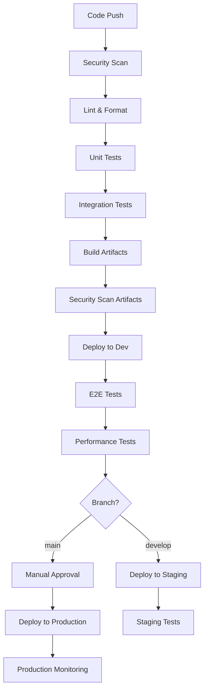

# Deployment Automation Strategy

> **Note**: This document outlines deployment automation requirements. Actual GitHub Actions workflows need to be implemented manually due to security restrictions.

## Overview

This document defines the deployment automation strategy for the AGI Evaluation Sandbox, including CI/CD pipelines, environment management, and release processes.

## Deployment Environments

### Environment Hierarchy

| Environment | Purpose | Branch | Auto-Deploy | Approval Required |
|-------------|---------|---------|-------------|-------------------|
| **Development** | Feature testing | `feature/*` | ✅ | ❌ |
| **Staging** | Pre-production testing | `develop` | ✅ | ❌ |
| **Production** | Live system | `main` | ❌ | ✅ |
| **Hotfix** | Emergency fixes | `hotfix/*` | ❌ | ✅ |

### Environment Configuration

```yaml
# environments.yml
environments:
  development:
    url: https://dev.agi-eval.your-org.com
    database: agi_eval_dev
    replicas: 1
    resources:
      cpu: "500m"
      memory: "1Gi"
    
  staging:
    url: https://staging.agi-eval.your-org.com
    database: agi_eval_staging
    replicas: 2
    resources:
      cpu: "1000m"
      memory: "2Gi"
    
  production:
    url: https://agi-eval.your-org.com
    database: agi_eval_prod
    replicas: 3
    resources:
      cpu: "2000m"
      memory: "4Gi"
```

## CI/CD Pipeline Architecture

### Pipeline Stages



### Required GitHub Actions Workflows

#### 1. Continuous Integration (`.github/workflows/ci.yml`)

```yaml
# CI Workflow Requirements
name: Continuous Integration

on:
  push:
    branches: [main, develop]
  pull_request:
    branches: [main, develop]

jobs:
  security-scan:
    # - Run Bandit security scan
    # - Run Safety dependency check
    # - Run Semgrep SAST analysis
    # - Upload SARIF results to GitHub Security
    
  lint-and-format:
    # - Run Black formatter check
    # - Run isort import sorting check
    # - Run Flake8 linting
    # - Run Ruff additional linting
    # - Run MyPy type checking
    
  test-python:
    strategy:
      matrix:
        python-version: ['3.9', '3.10', '3.11', '3.12']
    # - Setup Python environment
    # - Install dependencies with caching
    # - Run pytest with coverage
    # - Upload coverage to Codecov
    
  test-frontend:
    # - Setup Node.js environment
    # - Install dependencies with caching
    # - Run frontend tests
    # - Run Playwright E2E tests
    
  build-and-scan:
    # - Build Docker images
    # - Scan images with Trivy
    # - Push to registry if secure
    # - Generate SBOM
```

#### 2. Deployment Pipeline (`.github/workflows/deploy.yml`)

```yaml
# Deployment Workflow Requirements
name: Deployment Pipeline

on:
  workflow_run:
    workflows: ["Continuous Integration"]
    branches: [main, develop]
    types: [completed]

jobs:
  deploy-development:
    if: github.ref == 'refs/heads/develop'
    # - Deploy to development environment
    # - Run smoke tests
    # - Update deployment status
    
  deploy-staging:
    if: github.ref == 'refs/heads/develop'
    needs: deploy-development
    # - Deploy to staging environment
    # - Run full integration tests
    # - Update deployment status
    
  deploy-production:
    if: github.ref == 'refs/heads/main'
    environment: production
    # - Require manual approval
    # - Deploy to production with blue-green strategy
    # - Run health checks
    # - Update deployment status
```

#### 3. Release Management (`.github/workflows/release.yml`)

```yaml
# Release Workflow Requirements
name: Release Management

on:
  push:
    tags: ['v*']

jobs:
  create-release:
    # - Generate changelog with conventional commits
    # - Create GitHub release
    # - Build and publish packages
    # - Update documentation
    # - Notify stakeholders
```

## Deployment Strategies

### Blue-Green Deployment

```yaml
# Blue-Green Deployment Configuration
blue_green:
  enabled: true
  health_check_endpoint: "/health"
  health_check_timeout: 300
  rollback_threshold: 5  # Error rate percentage
  traffic_shift:
    - percentage: 10
      duration: 300  # 5 minutes
    - percentage: 50
      duration: 600  # 10 minutes  
    - percentage: 100
      duration: 0    # Complete shift
```

### Canary Deployment

```yaml
# Canary Deployment Configuration  
canary:
  enabled: true
  stages:
    - name: "canary-10"
      traffic_percentage: 10
      duration: 600
      success_criteria:
        error_rate: "<1%"
        response_time: "<500ms"
        
    - name: "canary-50"
      traffic_percentage: 50
      duration: 900
      success_criteria:
        error_rate: "<0.5%"
        response_time: "<300ms"
        
    - name: "full-deployment"
      traffic_percentage: 100
      duration: 0
```

## Infrastructure as Code

### Kubernetes Manifests

```yaml
# k8s/base/deployment.yaml
apiVersion: apps/v1
kind: Deployment
metadata:
  name: agi-eval-sandbox
  labels:
    app: agi-eval-sandbox
spec:
  replicas: 3
  selector:
    matchLabels:
      app: agi-eval-sandbox
  template:
    metadata:
      labels:
        app: agi-eval-sandbox
    spec:
      containers:
      - name: api
        image: your-org/agi-eval-sandbox:latest
        ports:
        - containerPort: 8000
        env:
        - name: DATABASE_URL
          valueFrom:
            secretKeyRef:
              name: database-secret
              key: url
        livenessProbe:
          httpGet:
            path: /health
            port: 8000
          initialDelaySeconds: 30
        readinessProbe:
          httpGet:
            path: /ready
            port: 8000
          initialDelaySeconds: 5
```

### Kustomization

```yaml
# k8s/environments/production/kustomization.yaml
apiVersion: kustomize.config.k8s.io/v1beta1
kind: Kustomization

resources:
- ../../base

patchesStrategicMerge:
- deployment-patch.yaml
- service-patch.yaml

configMapGenerator:
- name: app-config
  files:
  - config.yaml

secretGenerator:
- name: app-secrets
  files:
  - database.env
  - api-keys.env
```

## Monitoring and Observability

### Deployment Metrics

```yaml
# deployment-metrics.yml
metrics:
  deployment_duration:
    description: "Time taken for deployment"
    type: histogram
    labels: [environment, version]
    
  deployment_success_rate:
    description: "Percentage of successful deployments"
    type: gauge
    labels: [environment]
    
  rollback_count:
    description: "Number of rollbacks"
    type: counter
    labels: [environment, reason]
```

### Health Check Endpoints

```python
# Required health check endpoints
@app.get("/health")
async def health_check():
    """Liveness probe endpoint"""
    return {"status": "healthy", "timestamp": datetime.utcnow()}

@app.get("/ready")
async def readiness_check():
    """Readiness probe endpoint"""
    # Check database connection
    # Check external service dependencies
    # Return ready status
    return {"status": "ready", "checks": {...}}

@app.get("/metrics")
async def metrics():
    """Prometheus metrics endpoint"""
    return generate_prometheus_metrics()
```

## Security Considerations

### Deployment Security

1. **Image Scanning**
   - Scan all container images for vulnerabilities
   - Block deployment if high/critical vulnerabilities found
   - Generate and store SBOM (Software Bill of Materials)

2. **Secrets Management**
   ```yaml
   # secrets-management.yml
   secrets:
     provider: "kubernetes-secrets"  # or vault, aws-secrets-manager
     encryption: "at-rest"
     rotation: "30d"
     access_control: "rbac"
   ```

3. **Network Security**
   ```yaml
   # network-policies.yml
   network_policies:
     ingress:
       - from: ["monitoring-namespace"]
         ports: [9090]  # Metrics port
       - from: ["load-balancer"]
         ports: [8000]  # Application port
     egress:
       - to: ["database-namespace"]
         ports: [5432]
       - to: ["external-apis"]
         ports: [443]
   ```

## Rollback Procedures

### Automated Rollback Triggers

```yaml
# rollback-config.yml
rollback:
  triggers:
    error_rate: ">5%"      # Error rate threshold
    response_time: ">2s"    # Response time threshold
    health_check_failures: 3 # Consecutive failures
    
  strategy: "immediate"     # or "gradual"
  notification:
    - slack: "#deployment-alerts"
    - email: ["ops-team@your-org.com"]
```

### Manual Rollback Process

```bash
# Manual rollback commands
kubectl rollout undo deployment/agi-eval-sandbox
kubectl rollout status deployment/agi-eval-sandbox

# Verify rollback
kubectl get pods -l app=agi-eval-sandbox
curl -f https://agi-eval.your-org.com/health
```

## Disaster Recovery

### Backup Strategy

```yaml
# backup-strategy.yml
backup:
  database:
    frequency: "hourly"
    retention: "30d"
    encryption: true
    
  application_data:
    frequency: "daily" 
    retention: "90d"
    compression: true
    
  configuration:
    frequency: "on-change"
    retention: "1y"
    versioned: true
```

### Recovery Procedures

1. **Database Recovery**
   ```bash
   # Restore from backup
   pg_restore -h $DB_HOST -U $DB_USER -d agi_eval_prod backup.sql
   ```

2. **Application Recovery**
   ```bash
   # Deploy last known good version
   kubectl set image deployment/agi-eval-sandbox api=your-org/agi-eval-sandbox:v1.2.3
   ```

## Performance Optimization

### Deployment Performance

```yaml
# performance-config.yml
performance:
  parallel_deployments: true
  max_concurrent_pods: 5
  readiness_timeout: 300
  
  resource_limits:
    cpu: "2000m"
    memory: "4Gi"
    
  autoscaling:
    min_replicas: 3
    max_replicas: 10
    target_cpu: 70
    target_memory: 80
```

## Compliance and Governance

### Deployment Approvals

```yaml
# approval-matrix.yml
approvals:
  development:
    required: false
    
  staging:
    required: false
    auto_deploy: true
    
  production:
    required: true
    approvers:
      - "senior-engineers"
      - "security-team"
    minimum_approvals: 2
```

### Audit Trail

```yaml
# audit-requirements.yml
audit:
  deployment_logs:
    retention: "2y"
    encryption: true
    
  approval_records:
    retention: "5y"
    tamper_proof: true
    
  security_scans:
    retention: "1y"
    compliance_mapping: true
```

## Implementation Checklist

### Phase 1: Foundation (Week 1-2)
- [ ] Create basic CI/CD pipeline templates
- [ ] Set up development environment deployment
- [ ] Implement health check endpoints
- [ ] Configure basic monitoring

### Phase 2: Security (Week 3-4)
- [ ] Integrate security scanning
- [ ] Set up secrets management
- [ ] Implement network policies
- [ ] Configure RBAC

### Phase 3: Production Ready (Week 5-6)
- [ ] Implement blue-green deployment
- [ ] Set up production monitoring
- [ ] Configure backup procedures
- [ ] Implement rollback automation

### Phase 4: Optimization (Week 7-8)
- [ ] Implement canary deployments
- [ ] Optimize performance
- [ ] Set up advanced monitoring
- [ ] Configure auto-scaling

## Related Documentation

- [CI/CD Setup Guide](../workflows/CI_CD_SETUP.md)
- [Infrastructure Requirements](../operational/INFRASTRUCTURE.md)
- [Security Guidelines](../security/DEPLOYMENT_SECURITY.md)
- [Monitoring Setup](../operational/MONITORING.md)

---

**Note**: This document provides the deployment automation strategy. Implementation requires manual creation of GitHub Actions workflows, Kubernetes manifests, and infrastructure configurations based on your specific requirements and security policies.