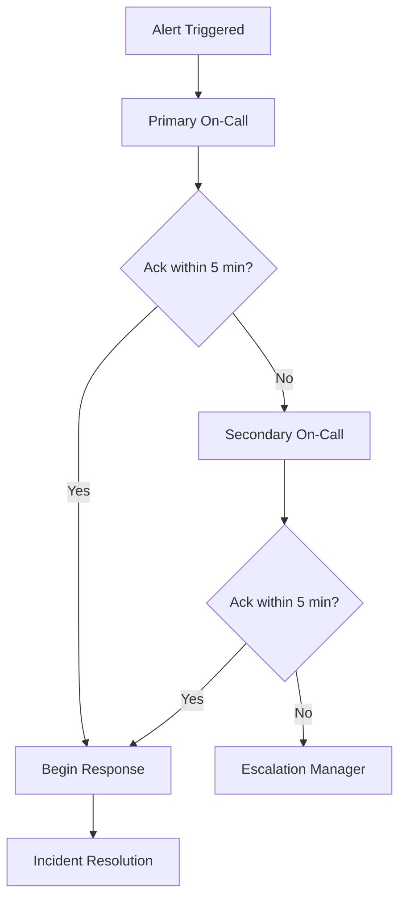

# Incident Response Playbook

This document outlines the incident response procedures for the AGI Evaluation Sandbox.

## Incident Classification

### Severity Levels

| Level | Description | Response Time | Examples |
|-------|------------|---------------|----------|
| **P1 - Critical** | System down, data loss | 15 minutes | Complete service outage, security breach |
| **P2 - High** | Major functionality impacted | 1 hour | API errors, authentication issues |
| **P3 - Medium** | Minor functionality impacted | 4 hours | Performance degradation, non-critical bugs |
| **P4 - Low** | Cosmetic or documentation | 24 hours | UI inconsistencies, typos |

### Incident Types

- **Service Outage**: Complete or partial system unavailability
- **Performance Degradation**: Slow response times, timeouts
- **Security Incident**: Unauthorized access, data breach
- **Data Integrity**: Corrupted or missing data
- **Infrastructure**: Hardware, network, or cloud service issues

## Response Team Structure

### On-Call Rotation

- **Primary On-Call**: Daniel Schmidt (@danieleschmidt)
- **Secondary On-Call**: TBD
- **Escalation Manager**: TBD

### Incident Commander Responsibilities

1. **Assess and Triage**: Determine severity and impact
2. **Coordinate Response**: Assemble response team
3. **Communicate**: Update stakeholders and users
4. **Document**: Maintain incident timeline
5. **Post-Incident**: Conduct review and follow-up

## Response Procedures

### P1 - Critical Incidents

```bash
# Immediate Actions (0-15 minutes)
1. Acknowledge alert in PagerDuty/monitoring system
2. Join incident bridge/chat room
3. Assess scope and impact
4. Declare incident and page additional responders
5. Begin status page updates

# Investigation (15-30 minutes)
1. Check system health dashboards
2. Review recent deployments/changes
3. Examine error logs and metrics
4. Identify root cause hypothesis

# Mitigation (30-60 minutes)
1. Implement immediate fixes or rollbacks
2. Scale resources if needed
3. Verify service restoration
4. Monitor for stability
```

### Communication Templates

#### Initial Status Update

```
🔴 INCIDENT: [Brief Description]
Status: Investigating
Impact: [Who/what is affected]
Started: [Time]
Next Update: [Time + 30 min]
```

#### Resolution Update

```
✅ RESOLVED: [Brief Description]
Root Cause: [Summary]
Duration: [Time]
Next Steps: [Post-incident review scheduled]
```

## Monitoring and Alerting

### Critical Alerts

```yaml
# Prometheus Alert Rules
groups:
  - name: critical_alerts
    rules:
      - alert: ServiceDown
        expr: up{job="agi-eval-api"} == 0
        for: 1m
        labels:
          severity: critical
        annotations:
          summary: "AGI Eval API is down"
          
      - alert: HighErrorRate
        expr: rate(http_requests_total{status=~"5.."}[5m]) > 0.1
        for: 2m
        labels:
          severity: critical
        annotations:
          summary: "High error rate detected"
          
      - alert: DatabaseConnectionFailed
        expr: up{job="postgresql"} == 0
        for: 30s
        labels:
          severity: critical
        annotations:
          summary: "Database connection failed"
```

### Escalation Paths



## Incident Documentation

### Required Information

1. **Timeline**: Chronological sequence of events
2. **Impact Assessment**: Users/services affected
3. **Root Cause**: Technical cause and contributing factors
4. **Resolution Steps**: Actions taken to resolve
5. **Lessons Learned**: Improvements and preventive measures

### Incident Report Template

```markdown
# Incident Report: [Title]

## Summary
- **Date**: YYYY-MM-DD
- **Duration**: X hours Y minutes
- **Severity**: P1/P2/P3/P4
- **Services Affected**: [List]
- **Users Impacted**: [Number/percentage]

## Timeline
| Time | Action | Owner |
|------|--------|-------|
| HH:MM | Incident detected | System |
| HH:MM | Response team notified | PagerDuty |
| HH:MM | Investigation began | @user |

## Root Cause
[Detailed technical explanation]

## Resolution
[Steps taken to resolve the incident]

## Impact
- **Downtime**: [Duration]
- **Data Loss**: [Yes/No, details]
- **Financial Impact**: [If applicable]

## Action Items
- [ ] Fix immediate cause
- [ ] Implement monitoring improvements
- [ ] Update documentation
- [ ] Schedule follow-up review
```

## Recovery Procedures

### Database Recovery

```bash
# PostgreSQL Recovery
# 1. Stop application services
docker-compose stop api

# 2. Restore from backup
pg_restore -h localhost -U postgres -d agi_eval backup_file.dump

# 3. Verify data integrity
psql -h localhost -U postgres -d agi_eval -c "SELECT COUNT(*) FROM evaluations;"

# 4. Restart services
docker-compose up -d
```

### Service Recovery

```bash
# Container Recovery
# 1. Check container status
docker-compose ps

# 2. Restart failed services
docker-compose restart api

# 3. Verify health checks
curl -f http://localhost:8000/health

# 4. Check logs for errors
docker-compose logs api --tail=100
```

### Rollback Procedures

```bash
# Application Rollback
# 1. Identify last known good version
git log --oneline -10

# 2. Create rollback branch
git checkout -b rollback-to-[commit-hash] [commit-hash]

# 3. Deploy rollback
docker build -t agi-eval-sandbox:rollback .
docker-compose up -d

# 4. Verify functionality
npm run test:integration
```

## Post-Incident Activities

### Immediate (Within 24 hours)

1. **Incident Closure**: Update status page and notifications
2. **Team Debrief**: Quick team discussion
3. **Customer Communication**: Detailed incident summary
4. **Action Item Creation**: Log follow-up tasks

### Short-term (Within 1 week)

1. **Root Cause Analysis**: Deep technical investigation
2. **Process Review**: Evaluate response effectiveness
3. **Documentation Updates**: Update runbooks and procedures
4. **Monitoring Improvements**: Add new alerts or dashboards

### Long-term (Within 1 month)

1. **System Improvements**: Implement preventive measures
2. **Training Updates**: Update team training materials
3. **Disaster Recovery Testing**: Validate recovery procedures
4. **Vendor Reviews**: Assess third-party service reliability

## Security Incident Response

### Data Breach Response

```bash
# Immediate Actions
1. Isolate affected systems
2. Preserve evidence and logs
3. Notify security team and legal
4. Begin forensic analysis

# Investigation Steps
1. Determine scope of breach
2. Identify compromised data
3. Trace attack vectors
4. Document evidence chain

# Recovery Actions
1. Patch vulnerabilities
2. Reset compromised credentials
3. Implement additional monitoring
4. Notify affected users/regulators
```

### Security Contacts

- **Internal Security Team**: security@terragon.ai
- **External Security Consultant**: TBD
- **Legal Counsel**: legal@terragon.ai
- **Regulatory Contact**: TBD

## Continuous Improvement

### Metrics to Track

- **Mean Time to Detection (MTTD)**
- **Mean Time to Resolution (MTTR)**
- **Incident Frequency by Type**
- **Customer Impact Minutes**
- **False Positive Alert Rate**

### Review Cadence

- **Weekly**: Incident review and action item progress
- **Monthly**: Trend analysis and process improvements
- **Quarterly**: Comprehensive procedure review
- **Annually**: Full disaster recovery testing

## Contact Information

### Emergency Contacts

| Role | Name | Phone | Email |
|------|------|-------|-------|
| Primary On-Call | Daniel Schmidt | TBD | daniel@terragon.ai |
| Secondary On-Call | TBD | TBD | TBD |
| Escalation Manager | TBD | TBD | TBD |

### Vendor Contacts

| Service | Contact | Support Level |
|---------|---------|---------------|
| AWS Support | TBD | Business/Enterprise |
| Database Support | TBD | TBD |
| Monitoring Service | TBD | TBD |